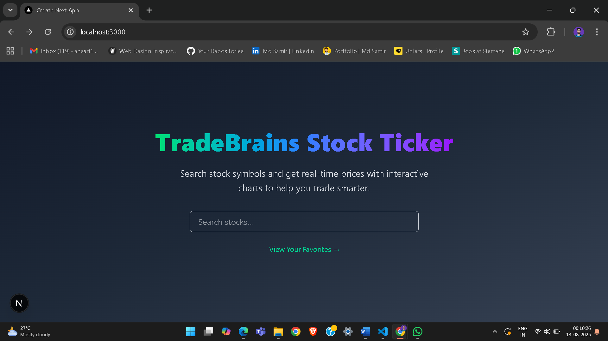
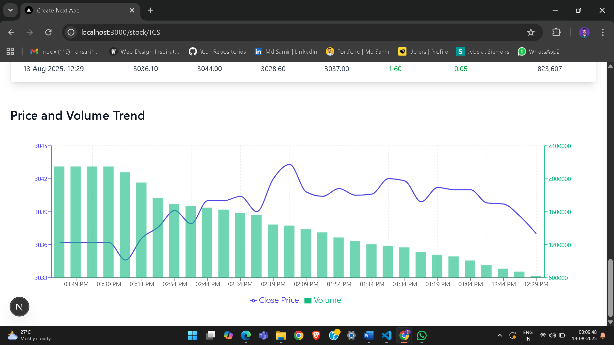

## 📈 TradeBrains Stock Ticker

A Next.js-based stock search and details application that allows users to search for stocks, view detailed price charts, and access stock information in real-time.  
Built as part of the TradeBrains assignment.


## 🚀 Features

1. **Stock Search Functionality**
   - Search for stock symbols using the provided API.
   - Autocomplete-style dropdown with search suggestions.
   - Click to navigate to stock detail pages.

2. **Stock Details Page**
   - Dynamic routing: `/stock/[symbol]`.
   - Displays stock price chart, latest price, and volume.
   - SEO-friendly meta tags for each stock.

3. **Interactive Graphs**
   - Price history visualization using **Recharts**.
   - Line chart for prices & volume bar chart.
   - Color-coded price change (green for gain, red for loss).

4. **Error Handling**
   - Custom error page for API failures.
   - Retry & Home navigation buttons.

5. **Bonus Features**
   - Loading animation themed for stock data.
   - Responsive design with Tailwind CSS.
   - Dark mode-inspired gradient UI.


## 🛠️ Tech Stack

- **Frontend Framework:** Next.js (v15+)
- **Styling:** Tailwind CSS
- **Charts:** Recharts
- **API:** TradeBrains Stock API
- **Deployment:** Vercel


## 📂 Project Structure


trade-brains-assignment/
│
├── components/         # UI Components (SearchBar, Loader, ErrorPage, Charts)
├── app/                # Next.js App Router Pages
│   ├── page.jsx         # Home Page
│   ├── stock/\[symbol]/  # Dynamic Stock Detail Page
│
├── lib/                # API utility functions
├── public/              # Static assets
├── styles/              # Global styles (Tailwind config)
└── README.md            # Project documentation


## ⚙️ Environment Variables

Before running locally, create a `.env.local` file:


NEXT_PUBLIC_API_BASE_URL=https://example-api-url.com


## 🖥️ Running Locally

```bash
# 1. Clone the repository
git clone https://github.com/mdsamir8863/trade-brains-assignment.git

# 2. Navigate to the project directory
cd trade-brains-assignment

# 3. Install dependencies
npm install

# 4. Run the development server
npm run dev

# 5. Open in browser
http://localhost:3000
```


## 📦 Deployment

This project is deployed on **Vercel**:
🔗 [https://trade-brains-assignment-xi.vercel.app/](https://trade-brains-assignment-xi.vercel.app/)


## 📸 Screenshots

### Home Page

*Search stocks with autocomplete suggestions*


### Stock Details Page

*Interactive price and volume charts*



## 🧑‍💻 Author

**Md Samir Ansari**
MERN Stack Developer specializing in frontend development.


## 📜 License

This project is for assignment purposes only. All rights reserved.

